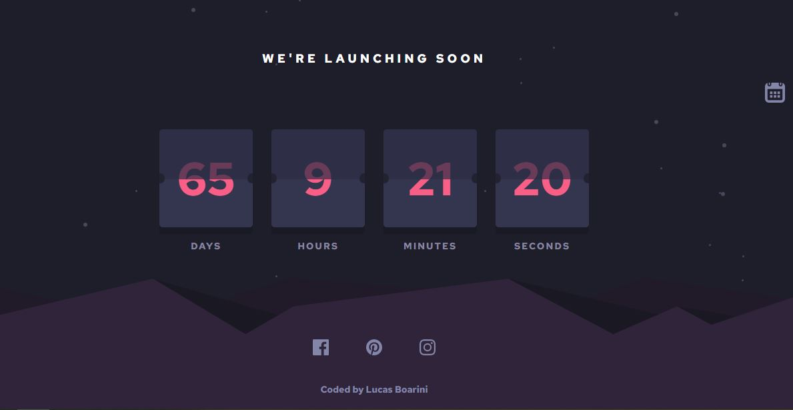

# Launch Countdown Timer

A proposta desse projeto é desenvolver um timer para contagem regressiva para lançamentos de foguetes, além de sua proposta ele pode ser utilizado para outras finalidades também. Por exemplo, a contagem regressiva para o dia do seu aniversário.

## Menu

- [O que aprendi](#o-que-aprendi)
- [Meu Processo](#meu-peocesso)
- [Screenshot](#screenshot)
- [Link](#link)
- [Construido com](#construido-com)
- [Contatos](#contatos)

### O que aprendi

Durante o desenvolvimento desse projeto, ao buscar soluções para fazer o timer aprendi a utilizar o método **setInterval** e a manipular informações com o DOM em conjunto. Outro ponto de melhoria foi no CSS onde consegui entender um pouco melhor sobre o pseudo-elemento **after** e também o **before**, onde utilizei eles para melhorar o design junto com uma animação para dar a impressão de ser um letreiro alternando de números.

### Meu Processo

Nesse projeto fiz realizando as seguinte etapas:

- [X] Montar estrutura básica do timer;
- [X] Estilizar design do timer;
- [X] Acertar links do footer;
- [x] Implementar função para contagem regressiva; 
- [X] Realizar estilização de flip no painel;
- [X] Implementar tela para escolher data;
- [X] Responsividade para mobile;

### Screenshot

Abaixo estou deixando um screenshot do design final do projeto conforme desenvolvi:

### Link

No link abaixo você será direcionado para o deploy dessa aplicação em funcionamento:

- [Countdown](https://launch-countdown-timer-rouge.vercel.app/)

### Construido com

As tecnologias utilizadas para esse projeto são as listadas abaixo:

- Semantic HTML5 markup
- CSS custom properties
- JavaScript

### Contatos

[LinkedIn](https://www.linkedin.com/in/lucas-boarini)

